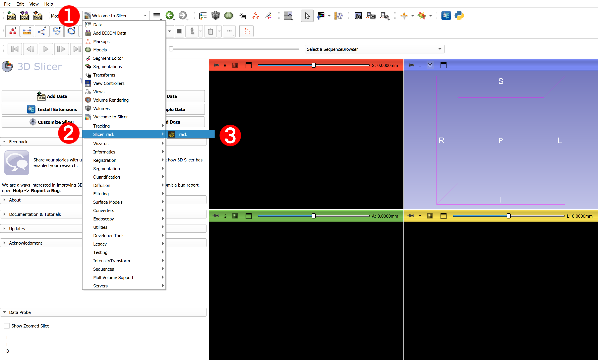
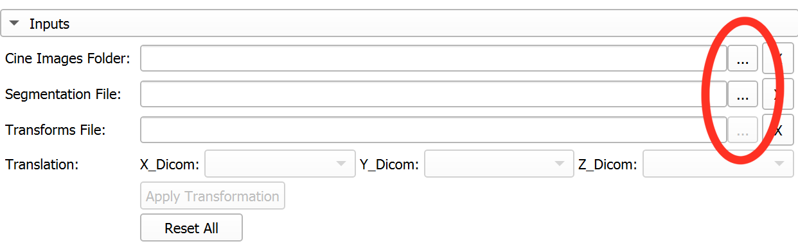
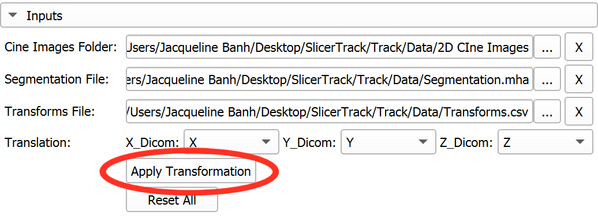
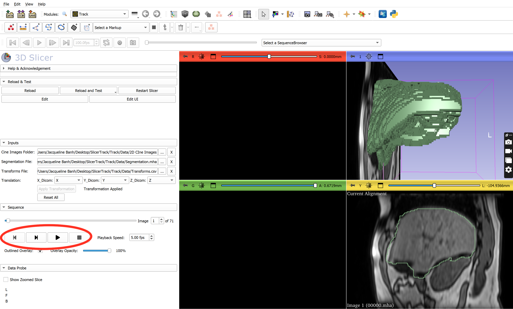

# Documentation
**All of the key features in SlicerTrack will be available in the extension’s** <mark style="background-color: lightgray">Inputs</mark> **and** <mark style="background-color: lightgray">Sequences</mark> **section**

1. Open SlicerTrack by selecting the (1) dropdown menu > (2) SlicerTrack > (3) Track
 
    
 
1. Load Inputs 

    Click the button next to the file path textbox to select the inputs easily

    - **Cine Images Folder:** Select the folder with cine images
    - **Segmentation File:** Select the 3D segmentation file
    - **Transformation File:** Select a transformation file
 
    
 
1. Designate Transformation Columns
    - Translation: 
        - **X_Dicom:** Select the header for the X-direction transformations
        - **Y_Dicom:** Select the header for the Y-direction transformations
        - **Z_Dicom:** Select the header for the Z-direction transformations
    - Click **Apply Transformations**
 
    
 

1. Review Tracking Results
    - After creating transform nodes from transformation data, the cine images and 3D segmentation are shown in the slice viewers
    - Use the built-in toolbar to replay tracking data
 
    
 

### Additional Features
- Play cine images zoomed in/out
- Adjust overlay opacity using the overlay opacity slider bar
- Use the image slider bar to move to a specific frame
- Insect frame number into the frame box to move to that specific frame
- Adjust the frames per second from 00.00 - 30.00 fps
- Click the X buttons to delete a specific input
- Click the Reset All button to remove all inputs 

## Sample Dataset

Dear Users,

This dataset was created based on a dataset sourced from the Cancer Imaging Archive (TCIA), and more specifically:

Hugo, G. D., Weiss, E., Sleeman, W. C., Balik, S., Keall, P. J., Lu, J., & Williamson, J. F. (2016). Data from 4D Lung Imaging of NSCLC Patients (Version 2) [Data set]. The Cancer Imaging Archive. https://doi.org/10.7937/K9/TCIA.2016.ELN8YGLE

Before accessing or utilizing this data, please refer to and adhere to the TCIA data use policy.

Warm regards

**Sample Data set can be download from** [here](https://drive.google.com/drive/folders/1qJj53YfGM4Q7atsI-XZyySvR-F98ENXA?usp=sharing)

### Pre-requisites

- 3D Slicer software version 5.6.1 installed 

### Install the Extension

- Get the extension install