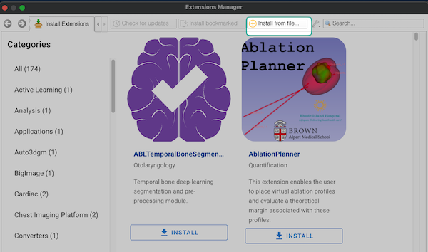

# Download and install 3D Slicer

*   Latest stable Slicer release is <b>recommended</b> to use for SlicerRT. These packages for Windows, Mac, and Linux can be downloaded from the [3D Slicer download page](http://download.slicer.org/).  
*   Preview Slicer builds can be used to access cutting edge Slicer features These packages can be downloaded from the same the [download page](http://download.slicer.org/). Note: Preview builds may fail from time to time. In that case the last successful preview build is available.

# Install SlicerRT

## Via Extension Manager

*   Download SlicerTrack Package from [here](https://drive.google.com/file/d/1k8vI_GSSBOjsnmf_VTtI6GF61TExri_o/view?usp=sharing)
*   Start 3D Slicer
  
*   Open Extension Manager
  

*   Click on Install from file...

*   Select the SlicerTrack package downloaded earlier.
*   After installing, restart Slicer and test the package.

<!-- 
  
*   Install SlicerTrack
  
 
-->

# System requirements

To run 3D Slicer you need the following configuration (SlicerRT extensions do not have any additional requirement):

*   Computer with a 64-bit operating system  [required]
*   Minimum 8GB RAM [recommended for optimal performance]
*   Dedicated nVidia GPU with 1GB RAM [recommended for 3D graphics display performance]. Note that integrated graphics cards are very slow compared to dedicated ones.
*   Quad-core intel processor [recommended for optimal processing speed]
