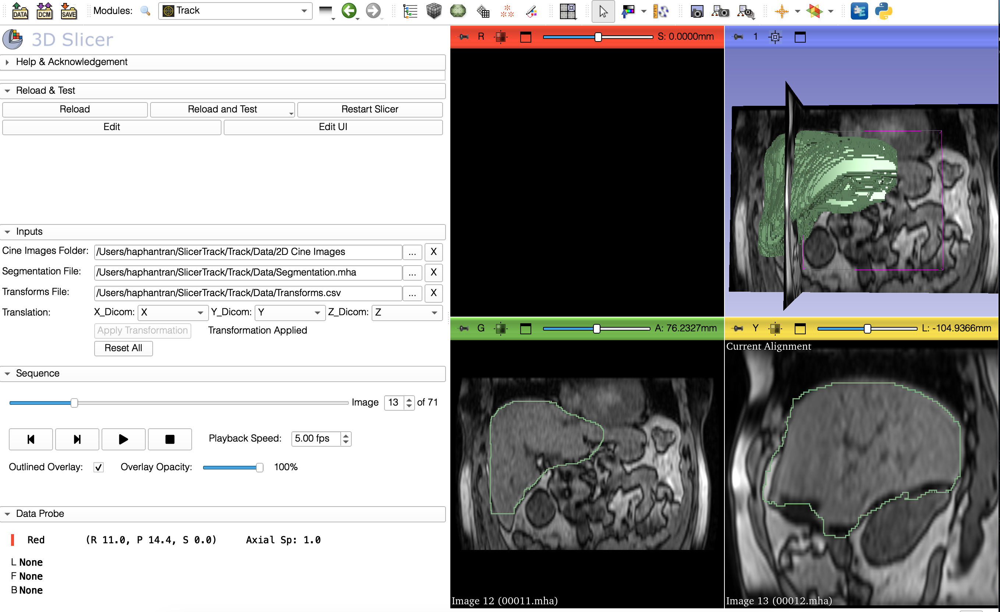
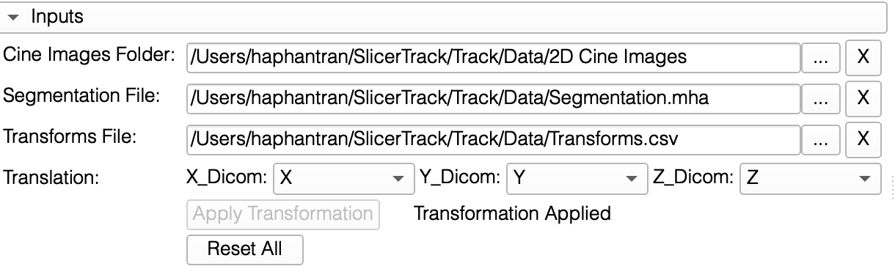
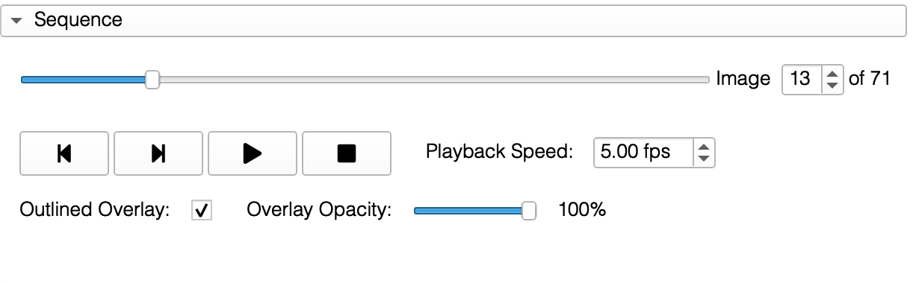

# SlicerTrack

## About

SlicerTrack is open-source, extendable, developed in Python as an extension on the highly successful 3D Slicer platform. SlicerTrack is built for target tracking visualization by replaying cine 2D images and overlays the outline of the Region of interest (ROI) using a displacement data file. We open source the code of SlicerTrack on [GitHub](https://github.com/laboratory-for-translational-medicine/SlicerTrack) for compilation and further development.

## What can SlicerTrack do?

The extension accepts three inputs from the user:

- A set of cine MR images
- A segmentation of the ROI
- The transformation data reflects the amount of displacement of the ROI expressed in the DICOM coordinate system. It can be in csv, txt, xlsx or xls format.

Users can change playback speed, overmask mask outline or opacity. Once the user presses play, the extension will go through the series of MR images with the segmentation overlaid on the current image. Users can decide to pause at any frame or go to any particular MR image using the sequence slider.

## Contact us

If you encounter any problem, please contact:

[SlicerTrack@cs.torontomu.ca](mailto:SlicerTrack@cs.torontomu.ca)