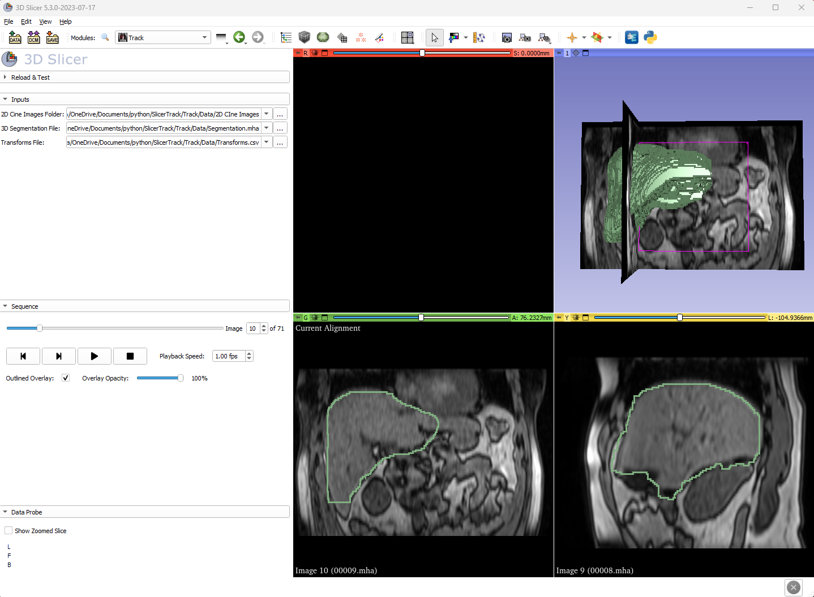
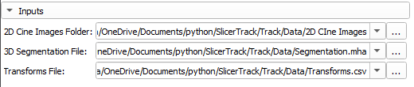

# About SlicerTrack

SlicerTrack is open-source, extendable, developed in Python as an extension on the highly successful 3D Slicer platform. SlicerTrack is built for target tracking visualization by replaying cine 2D images and overlays the outline of the Region of interest (ROI) using a displacement data file. We open source the code of SlicerTrack on [GitHub](https://github.com/laboratory-for-translational-medicine/SlicerTrack) for compilation and further development.

## Screenshot

# What can SlicerTrack do?

The extension accepts three inputs from the user:

- A set of cine 2D MR images
- 3D segmentation of the ROI
- Transformation data in CSV format. The transformation data includes the registration results of the ROI from each cine 2D image to a 3D reference image

Users can change playback speed, overmask mask outline or opacity. Once the user presses play, the extension will go through the series of 2D images with the 3D segmentation overlaid on the current 2D image. Users can decide to pause at any frame or go to any particular 2D image using the sequence slider.

---

# Contact us

If you encounter any problem, please contact:

[SlicerTrack@cs.torontomu.ca](mailto:SlicerTrack@cs.torontomu.ca)
